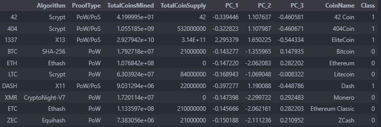
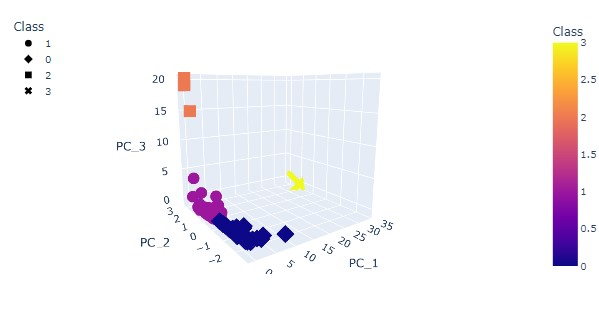
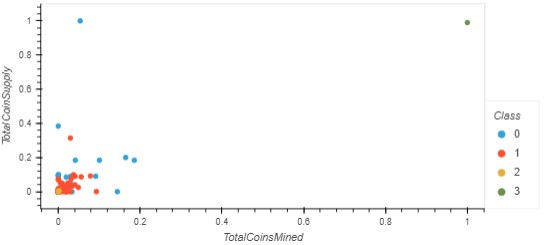

# Cryptocurrencies & Unsupervised Machine Learning

## Resources

- **Data Source:** 
  - [crypto_data.csv](crypto_data.csv)
- **Software:** Python, Pandas, Hvplot, Plotly, Sklearn

## Challenge Project Overview 

Using Sklearn, Python, & Plotly, I analyzed a dataset of cryptocurrencies with unsupervised machine learning algorithms to spot any trends that would make a client want to invest in them. Since Ethereum and Bitcoin have already exploded in value, there is great interest in finding the next big project among all the alternative coins. That said, I will be using unsupervised machine learning to see if we can spot any trends resulting in altcoin opportunities. 

## Challange Project Analysis

#### Step 1: Preprocessing the Data for PCA 

I began by preprocessing the dataset provided so that the machine learning algorithm would run correctly. The preprocessing process started by uploading the CSV dataset, filtering only tradable currencies, dropping null values, double-checking for missing values, keeping mined coins only, and numerically encoding categorical columns using the pandas.get_dummies method, and scaling the data using the StandardScaler() method.

#### Step 2: Reducing Data Dimensions Using PCA

Next, using Principal Component Analysis (PCA), I reduced the dimension of 98 scaled columns to only three principal component columns.

#### Step 3: Clustering Cryptocurrencies Using K-Means

To see how many clusters (k) I could divide the cryptos into, I created an elbow curve to identify the best number of clusters. 

The ideal amount of clusters is where the line graph starts to take a significant, noticeable pivot on the line graph. So, I then proceeded with the KMeans analysis to fit the PCA dataframe and predict the clustering. As it can be seen, the optimal result was 4 clusters. The product was this clustered_df with a 'Class' column showing the predictions to which group it belonged.

#### Step 4: Visualizing Cryptocurrencies Results

To better interpret the data, I created visuals to understand the results better. The 3D scatter plot located each clustered crypto concerning the three principal components assembled on the PCA. As seen, there are three major groups and one outlier (which can be seen in yellow).

There are two noticeable outliers when plotting the clustered cryptos by total supply and mined coins. The first outlier, BitTorrent Crypto, has an extensive supply of coins and mined coins. While the second outlier, BitTorrent Crypto, has an unusually vast supply of total coins.

## Challange Project Summary

Unsupervised machine learning is supposed to discover patterns or groups of data when there is no known output. That being said, this analysis successfully grouped cryptocurrencies into four groups. If we were to create a crypto investment portfolio, we would need to analyze the clusters further. Nevertheless, we have a good starting point where we can see that the most profitable and known cryptos are somewhat in the two groups with less supply and mined coins compared to others. These cryptos are Bitcoin and Ethereum. Nevertheless, we should keep up with the innovations of technology where new altcoins are being created with exciting value propositions.
